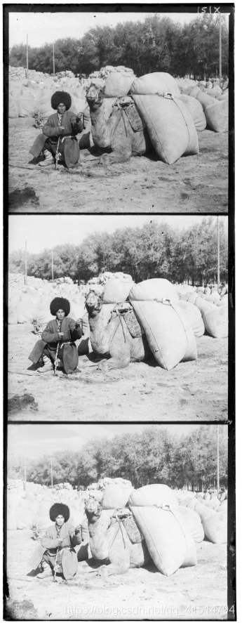
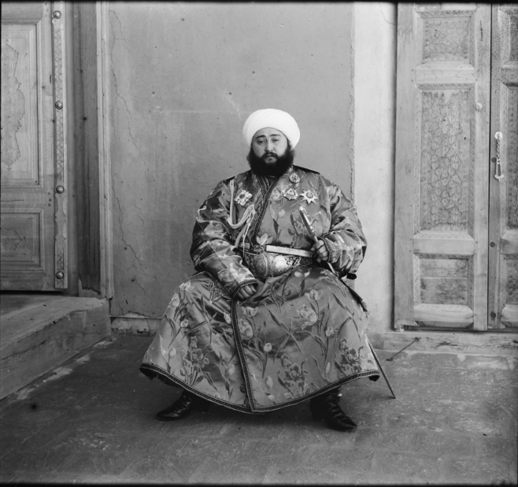
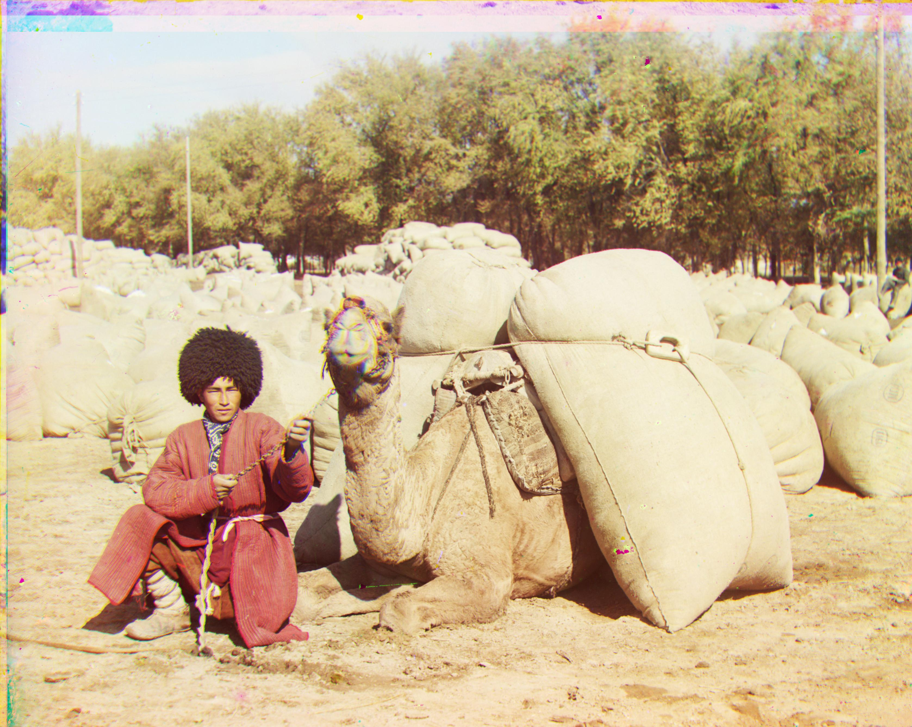
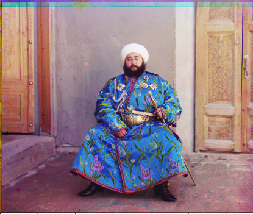
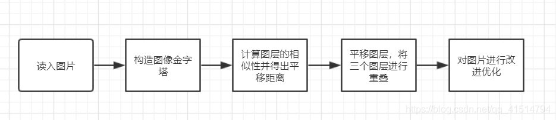
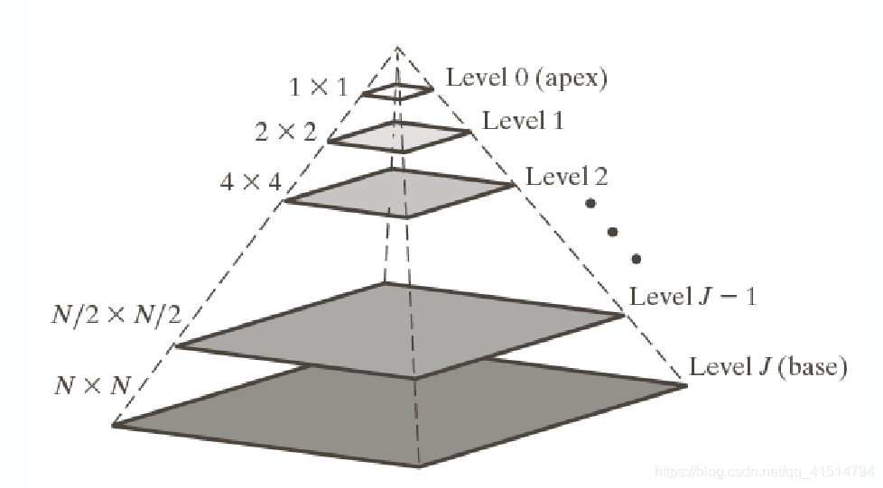
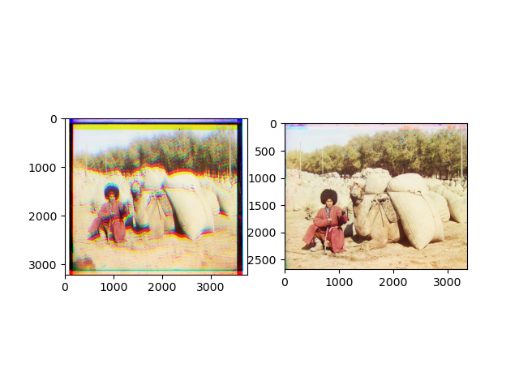

# 彩色图像复原

## 效果展示

### 原始图像




&nbsp;

### 修复后图像




&nbsp;

### 修复过程

彩色摄影法原理: 分别用红、绿、蓝滤光片把每个场景的三次曝光记录到一个玻璃底板上，并设想通过特殊的投影装置将三种颜色的底片叠加显示，从而显现彩色照片。

修复原理：将图像从上到下分成三个相等的部分，并将第二部分和第三部分(G和R)通过cv.merge()函数叠加到第一部分(B)。将它们对齐并彼此叠加在一起，最终形成一张RGB彩色图像。

我们要通过数字图像处理进行彩色图片复原，需要首先获得图片不同颜色的三个图层，在图层处于灰度模式时，将红色（R）、蓝色（B）和绿色（G）层对齐，形成“RGB”颜色组合。对齐之后将得到一副带有杂乱边框的图片，可以通过裁剪将其剪去，裁剪后的颜色组合整体调整以创建适当的对比度、适当的高光和阴影细节以及最佳的颜色平衡，最终可以完成彩色图片的恢复。



### 实现方案

1.读入文件，若为tif文件将其转换为8位无符号整数格式，之后转换成灰度图

```python

pic_name = '../turkmen.tif'  #图片名
 
im =  cv.imread(pic_name)  #将图像转换为8位无符号整数格式
 
if '.tif' in pic_name:
 
    im=skimage.util.img_as_ubyte(im)
 
im = cv.cvtColor(im,cv.COLOR_BGR2GRAY)
 
#之后会利用图片构造高斯金字塔，保留原始图片
 
im_old = im.copy()

```

2.通过构造高斯金字塔的方法解决。先对图片进行高斯滤波处理以使图片即时缩小也能保留较多细节，然后再每次删除一半的行和列达到减小图片大小的效果,原理如图:


```python
#由于初始图像已存至变量im_old，只需保留满足大小要求的最后一层图像即可
 
#计算高斯核函数
 
    def gausskernel(size):  
 
    sigma=0.8
 
    gausskernel=np.zeros((size,size),np.float32)
 
    k = int(size/2)
 
    print(k)
 
    for i in range (size):
 
        for j in range (size):
 
            norm=math.pow(i-k,2)+pow(j-k,2)
 
            gausskernel[i,j]=math.exp(-norm/(2*math.pow(sigma,2)))    
 
    sum=np.sum(gausskernel)   # 求和
 
    kernel=gausskernel/sum   # 归一化
 
return kernel
 
 
 
def pyramid_Gauss(image):   
 
    kernel=gausskernel(3)        #阶数取3
 
    temp = image.copy() 
 
    (length,width) = temp.shape[:2]
 
    length = length / 3.0
 
    cnt = 0  
 
#当图片过大对其构造高斯金字塔使其大小小于一定限度
 
    while length * width > 250000 :
 
        cnt = cnt + 1
 
        temp = pyramid_Down(temp,kernel)
 
        (length,width) = temp.shape[:2]     
 
    cv.imshow("pyramid_down_" , temp)       
 
    return temp,cnt
 
 
 
def pyramid_Down(image,kernel):
 
    (length,width) = image.shape[:2]
 
    img1 = np.zeros((length,width),np.uint8)
 
# 高斯滤波过滤
 
    for i in range (1,length-1):
 
        for j in range (1,width-1):
 
            print(i,j)
 
            s = 0
 
            for k in range(-1,2):
 
                for l in range(-1,2):
 
                    s = s + image[i+k,j+l]*kernel[k+1,l+1]  
 
            img1[i,j] = s
 
   #删去一半的行和列，构造高斯金字塔1
 
    cnt = 0
 
    for i in range(length):
 
        if i % 2 == 1:
 
            img1 = np.delete(img1, i - cnt, axis=0)
 
            cnt = cnt + 1
 
    cnt = 0
 
    for j in range(width):    #删列操作与上文类似，在此省略
 
        ……
 
    #主函数调用上述函数完成操作
 
im,count = pyramid_Gauss(im)
 
print('pyramid finished!')
```

3.计算图层相似性及平移距离

思路描述：由公式：

SSD(u,v) =  Sum{[Ima_1(u+x,v+y) – Ima_2(x,y)] ^2} 

可计算并比较图层间的相似程度。

```python
def find_min_ssd(img_1,img_2,r_lim,d_lim):
 
      #寻找两幅图片的最小ssd所需平移的坐标
 
      #img_1固定，img_2平移的空间为[-r_lim,-d_lim] -> [r_lim,d_lim]
 
      length,width = img_1.shape[:2]
 
 
 
      #最小ssd初始化为无穷大
 
      min_ssd = float("inf")
 
      min_r = 0
 
      min_d = 0
 
      sum_ssd = 0
 
      for r_dis in range(-r_lim,r_lim+1):
 
          for d_dis in range(-d_lim,d_lim+1):
 
              sum_ssd = 0
 
              for i in range(length):
 
                  for j in range(width):
 
                      x = i + d_dis
 
                      y = j + r_dis
 
                      if(x >= 0 and x < length and y >= 0 and y < width):
 
                          sum_ssd = sum_ssd + (int(img_1[x,y])-int(img_2[i,j])) * (int(img_1[x,y])-int(img_2[i,j]))
 
              sum_ssd = sum_ssd
 
              if sum_ssd < min_ssd:
 
                  min_r = r_dis
 
                  min_d = d_dis
 
                  min_ssd = sum_ssd
 
return min_r,min_d
 
#在主函数中调用上述函数
 
height = np.floor(im.shape[0]/3.0).astype(np.int)
 
b = im[:height]
 
g = im[height:2 * height]
 
r = im[2 * height:3 *height]
 
(a1,b1) = find_min_ssd(r,b,15,15)
 
(a2,b2) = find_min_ssd(r,g,15,15)
 
#每一层高斯金字塔图片的长宽各缩小一倍，共建了count层，需要使平移参数乘上2的count次方
 
k = math.pow(2,count)
 
a1 = int(a1 * k)
 
b1 = int(b1 * k)
 
a2 = int(a2 * k)
 
b2 = int(b2 * k)
```

4.平移图层，将三个图层重叠得到彩色图片。

思路描述：通过调用translate函数对图像进行仿射变化，达到平移的效果。

关键代码：

```python

def translate(img,tx,ty):
 
    #图像平移
 
    length,width = img.shape[:2]
 
    m = np.float32([[1,0,tx],[0,1,ty]])
 
#仿射变换
 
    res = cv.warpAffine(img,m,(width,length))
 
    return res
 
#在主函数中调用上述函数
 
b = translate(b,a1,b1)
 
g = translate(g,a2,b2)
 
im_out = cv.merge((b,g,r))
 
print(a1,b1,a2,b2)
 
cv.imshow("aligned image",im_out)
 
cv.imwrite('../turkmen_2.tif',im_out)
```

叠加效果图：



### 总结

要对彩色图像进行恢复，首先需要获得图片不同颜色的三个图层，在图层处于灰度模式时，将红色（R）、蓝色（B）和绿色（G）层对齐，形成“RGB”颜色组合。对齐之后将得到一副带有杂乱边框的图片，可以通过裁剪将其剪去，裁剪后的颜色组合整体调整以创建适当的对比度、适当的高光和阴影细节以及最佳的颜色平衡，最终可以完成彩色图片的恢复。
